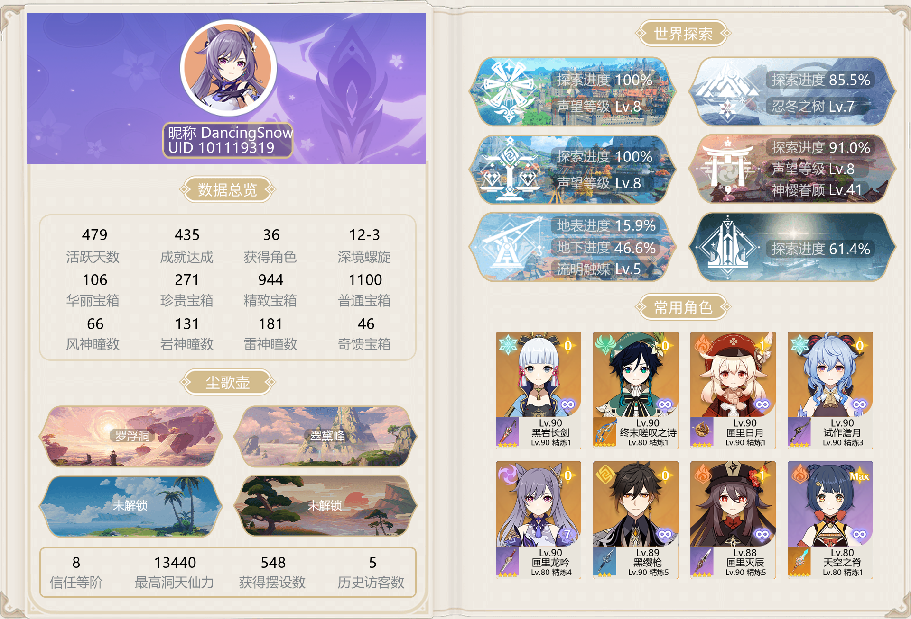
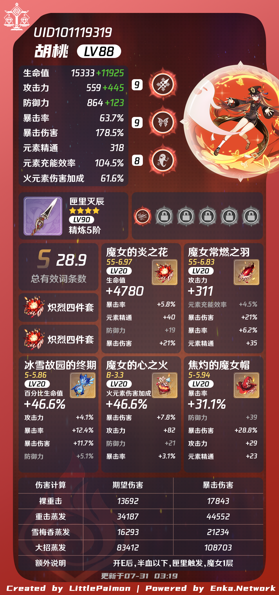
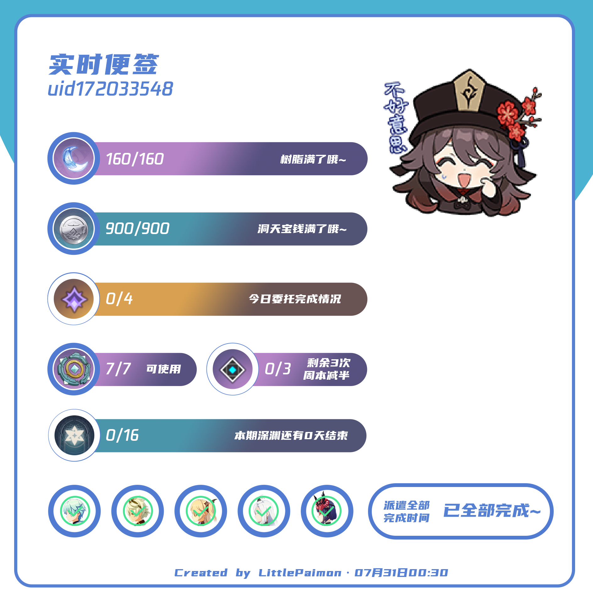
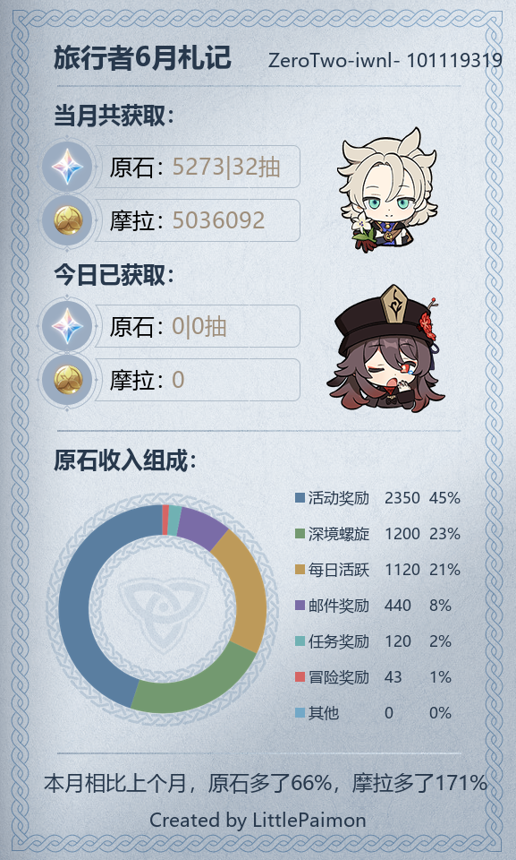
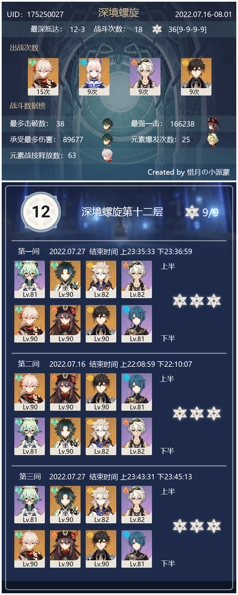
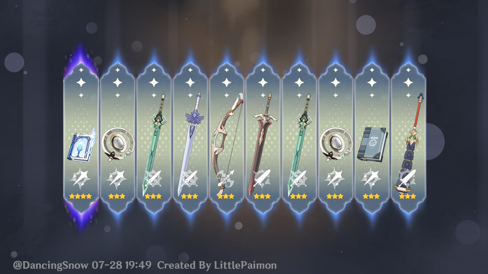
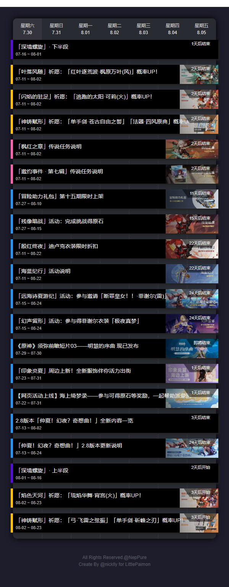

<p align="center">
  <a href="https://github.com/DancingSnow0517/LittlePaimon_khl"></a>
</p>
<h1 align="center">
  小派蒙 | LittlePaimon
</h1>
<h3 align="center">
  ✨基于 <a href="https://github.com/TWT233/khl.py" target="_blank">khl.py</a> 的KooK机器人✨
</h3>
<p align="center">
  <a href="https://cdn.jsdelivr.net/gh/DancingSnow0517/LittlePaimon_khl@master/LICENSE"></a>
  
  
  <a href="https://kook.top/mBVrnI">
    
  </a>
</p>

## 丨简介

原神多功能机器人，通过米游社接口查询uid的游戏信息等

## 丨功能示例



<details>
<summary>角色面板</summary>

</details>
<details>
<summary>角色背包</summary>

</details>
<details>
<summary>实时便笺</summary>

</details>
<details>
<summary>每月札记</summary>

</details>
<details>
<summary>深渊信息</summary>

</details>
<details>
<summary>模拟抽卡</summary>

</details>
<details>
<summary>原神日历</summary>

</details>

## 丨更新日志

---

## 丨部署方法

+ 安装 `Python 3.8+`
+ 安装 `git`
+ 下载代码并启动
```
# 克隆本仓库到本地
git clone https://github.com/DancingSnow0517/LittlePaimon_khl.git

# cd 到代码目录
cd LittlePaimon_khl

# 安装所需依赖
pip install -r requirements.txt

# 运行主程序
python main.py
```

此时目录会生成配置文件 `config.yml`

打开并编辑里面的 `token`, 填上你的 `kook` 机器人的 `token` 并再次运行 `main.py`

### Token 获取方法

到 [「KOOK」开发者内测 ](https://kaihei.co/RzFIH8) 申请开发者内测权限

在 [网页后台：开发者中心 - 应用 ](https://developer.kaiheila.cn/app/index) 创建一个应用，然后点开刚创建好的应用
  - 大家能在左侧的「设置」选项卡列表中看到一项「机器人」，点开它
  - 点开「机器人」选项卡后，就能看到机器人的信息以及「机器人连接模式」、「Token」两项重要选项
## 丨感谢

来自 [TWT233](https://github.com/TWT233) 的 [khl.py](https://github.com/TWT233/khl.py) - 一个非常好用的 python 机器人框架

来自 [CMHopeSunshine](https://github.com/CMHopeSunshine) 的 [LittlePaimon](https://github.com/CMHopeSunshine/LittlePaimon) - 此机器人的原型

## 丨TODO LIST

- [X] 原神猜语音
- [X] 小派蒙日历
- [X] 派蒙聊天
- [X] 云原神
- [ ] 米游币商品抢兑
- [X] 原神模拟抽卡
- [ ] 小派蒙的原神抽卡记录模块
- [X] 小派蒙的原神信息查询
- [ ] 小派蒙的wiki查询